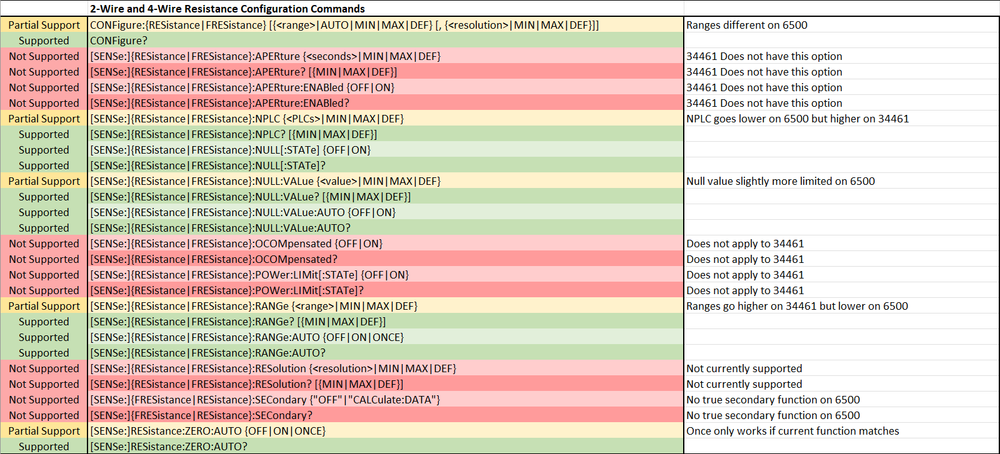

# Background

During my time at Tektronix, I worked on multiple projects intended to meet customer demands for sales. These were often purpose built software tools to make the customer's desired test simpler. The largest of these projects was a script to emulate a Keysight 34461A on a Keithly DMM6500. This would allow a customer to fully migrate their system from Keysight to Keithly products. I had just shy of two months to release a minimum viable product before I would have to hand the project to a new co-op who would have to be onboarded before they could effectively contribute. This script had to be functional and easily understandable for new employees to support it and for the customer to use it. This project challenged my organizational and communication skills.

# Project Features

## Feature and Progress Tracking

One of the most important features of this project is not technical, rather the tools I developed to stay organized over my months of working on this project. I distinctly remember getting assigned this project and feeling totally overwhelmed. To mitigate this, I created a master spreadsheet to track my progress and communicate feature support.

In the spreadsheet, I recorded every command in the 3446X family and assigned each a development status. Whenever I chose not to support or partially support a command I left a detailed justification in the spreadsheet to prevent me or others from rediscovering the lessons I had previously learned.



As well as being a development tool, this spreadsheet serves as a key piece of documentation. Any intended deviations from the 34461A operation is recorded in the sheet

## Documentation

At the start of this project, I had just short of two months before I had to go back home for my spring semester of school. When I left, this script would have to be supported by the product applications team. As the code is public, customers also had to be able to look under the hood and understand my thought processes. I wanted the "learning time" for this project to be as short as possible (especially since the script is over 10,000 lines long) so I wrote a developers' guide and took special care to make the source code as readable as possible.

The developer's guide aimed to provide a big picture look at the program that is not possible in the source code itself. I begin with a few links to resources I found useful to reference through my development. The rest of the document is dedicated to outlining the major sections of the script. This includes descriptions of important structures, major functions, and overall logic and program flow. I highly recommend taking a peek at this document to get a good sense of what I wrote.

[Link to Developer's Guide](https://github.com/Obind30/34461A-Emulator/blob/main/Developer%20Files/34461A_Emulation_Developer's_Guide.docx)

This document gave me a great opportunity to improve my technical writing in the industry setting.

## Device State Storage

The 34461A stores it's set preferences differently than the 6500 so I could not rely on just setting and querying the 6500 state. To properly emulate these differences, I created a fully custom instrument state structure.

The `gInstrumentState` structure is separated by what measurement function a setting applies to. If a setting is global it falls under `General`. Each instrument setting has the following attributes:

- `value`: This is the actual value of the variable, things that require a TSP enumeration to set (ex. `dmm.ON` or `dmm.OFF`) will have their value as one of the items in another structure called `gInstrumentAttributes`. This aliases many enumeration values to simplify later parts of the script. This is set to `nil` initially, it is later set in a reset function.
- `valueParent`: A reference to the item in `gInstrumentAttributes` that stores all the possible values for this variable.
- `getter`: The corresponding getter function for this variable, necessary to programmatically check this variable. Getters are also more efficient for larger programs.
- `setter`: The corresponding setter function for this variable, necessary to programmatically set/reset this variable. Setters are also more efficient for larger programs.

A simplified version of the instrument state structure looks as follows:

```Lua
local gInstrumentState = 
{
    Measure_Function =
    {
        value = nil,
        valueParent = nil,
        getter = gAccessors.mGetMeasureFunction,
        setter = gAccessors.mSetMeasureFunction,
    },
    General = 
    {
        Trigger_Delay_Auto =
        {
            value = nil,
            valueParent = nil,
            getter = gAccessors.mGetMeasureAutodelay,
            setter = gAccessors.mSetMeasureAutodelay,
        },
    },
    Capacitance = 
    {
        Null_State = 
        {
            value = nil,
            valueParent = nil,
            getter = gAccessors.mGetRelEnable,
            setter = gAccessors.mSetRelEnable,
        }
    },
    DC_Current =
    {
        Null_State = 
        {
            value = nil,
            valueParent = nil,
            getter = gAccessors.mGetRelEnable,
            setter = gAccessors.mSetRelEnable,
        }
    },
}
```

## Tree Based Parsing

I was initially given an older emulation script used to emulate SMU's. While all the instrument specific code was not particularly useful, the command intercepting and parsing method was a great help. I was able to take the existing parsers and modify them for my use case. One of my favorite parts of the parser is the command tree.

Each command needs too be stored with the following attributes:

- (`mPath`)
  - Header Element sub-tree (for path, when next char is a :)
  - This member is implied. `mPath` is the series of keys used to get to the current header.
- `mCommand`
  - **Command element** for a command (if not a path) (See command element below)
- `mQuery`
  - **Command element** for a query (if not a path) (See command element below)

The initialization for `gCommandTree` appears as:

```Lua
gCommandTree = 
{
    ["CONFIGURE"] =
    {
        mQuery = {},
        ["CURRENT"] =
        {
            ["AC"] =
            {
                mCommand = {},
            },
            ["DC"] =
            {
                mCommand = {},
            },
        }
    }
}
```

This example would let you call the SCPI commands `CONFIGURE?` (query), `CONFIGURE:CURRENT:AC` (command), and `CONFIGURE:CURRENT:DC` (command). To access one of these **command elements** in the script you would use `gCommandTree["CONFIGURE"]["CURRENT"]["AC"]` for example. This is what is meant by `mPath` is implied, the path element is really just the set of keys used to get to the desired command.

**Command elements** are structured as:

- `mExecute`
  - The function to execute when command/query is run.
- `mParameters`
  - The array of parameter elements for parameters that should be in the SCPI command call.

Finally, parameter elements are structured as:

- `mOptional`
  - True if parameter is optional. False or nil if not.
- `mParse`
  - Parser function. (These are defined in a separate table)
- `mData`
  - This is only needed when mParse is set to ParseParameterChoice. This is when a single parameter may be a number of possible types that require different parsers. mData should be a table of parser functions.
- `mNames`
  - This is used when mParse is set to ParseParameterName. This should be a table of name keys and their return values.

While these nested structures offer upfront complexity in initial understanding of the program, the benefits are clear when they get used. All the command data falls under a single structure. This is especially helpful in the main command parsing functions.

## Trigger Model Emulation

The trigger model is an essential part of advanced instrumentation. It offers superior speed and accuracy through pre-compiling programs and configuring them in hardware before running. However, the Keysight trigger model is far simpler than the Tektronix one. So I wrote custom functions to configure a DMM6500 trigger model to behave like a 34461A trigger model.

The 344161A trigger model is used to configure exactly when measurements happen when a trigger is sensed whereas the DMM6500 can include logic, looping, and more. The initialization function (shown below) starts by configuring a timer to delay measuring start to allow values to settle. This is done according to user specifications. Then a 6500 trigger model is made. The logic is as follows.

1) If the model must wait on an external trigger, include wait logic,
2) If there is an autodelay for measurements, trigger the timer, then wait for it's completion before continuing
3) Take a single measurement
4) Loop back to step 1 for `sample_count` iterations
5) Loop back to step 1 for `trigger_count` iterations

```Lua
gTriggerModel.InitializeTM = function()
    -- Trigger Delay Timer
    gTriggerTimer.clear()
    gAccessors.mSetTriggerTimerCount(1)
    -- Stimulus is the trigger model event
    gAccessors.mSetTriggerTimerStimulus(trigger.EVENT_NOTIFY1)
    -- 0 if autodelay
    if gInstrumentState.General.Trigger_Delay_Auto.value.shorthand ~= 1 then
        gAccessors.mSetTriggerTimerDelay(gInstrumentState.General.Trigger_Delay.value)
    end
    gAccessors.mSetTriggerTimerEnable(trigger.ON)

    gTM.load("Empty")
    -- Set wait event based on trigger source
    if gInstrumentState.General.Trigger_Source.value == "EXT" then
        gTM.setblock(1, trigger.BLOCK_WAIT, trigger.EVENT_EXTERNAL, trigger.CLEAR_ENTER)
    elseif gInstrumentState.General.Trigger_Source.value == "IMM" then
        gTM.setblock(1, trigger.BLOCK_NOP)
    end
    -- Change timing based on trigger delay auto
    if gInstrumentState.General.Trigger_Delay_Auto.value.shorthand ~= 1 then
        -- Notify trigger delay timer to start
        gTM.setblock(2, trigger.BLOCK_NOTIFY, trigger.EVENT_NOTIFY1)
        -- Wait for trigger delay timer
        gTM.setblock(3, trigger.BLOCK_WAIT, trigger.EVENT_TIMER1)
    else
        gTM.setblock(2, trigger.BLOCK_NOP)
        gTM.setblock(3, trigger.BLOCK_NOP)
    end

    -- Take measurement
    gTM.setblock(4, trigger.BLOCK_MEASURE_DIGITIZE, gReadingMemory.readingBuffer, 1)
    
    -- Loop back to notify
    gTM.setblock(5, trigger.BLOCK_BRANCH_COUNTER, gInstrumentState.General.Sample_Count.value, 2)
    -- Loop back to wait
    gTM.setblock(6, trigger.BLOCK_BRANCH_COUNTER, gInstrumentState.General.Trigger_Count.value, 1)

    gTriggerModel.tmInitialized = true
end
```

I loved finding ways to emulate the internal logic of the 34461A trigger model in the 6500. Making the trigger model fully configurable was a challenge but I feel that I came to a simple, clean solution.

# Room For Improvement
While I am very proud of this emulator there were multiple features and issues that I would have loved to dive deeper into:

- Improved and more extensive testing
  - I feel I properly prioritized support given my resources at hand
  - I worked hard to mitigate the effects of this through extensive documentation
- Ensure parity in error messages and reporting
  - Lack of parity can lead to confusion in development
  - Implementation would require major time investment
- Expand command support beyond that of the 34461A
  - Other 344XX instruments could perform more tasks than 34461A
  - This is a "nice to have" and dependent on user need

These improvement points are all cases of "if I had more time" but that is often a sentiment felt after a deadline. Ultimately, with the resources I was given, I feel I released a competent product that will serve Tektronix well.

# Lessons Learned

This project was full of new lessons for me, many of which were managerial rather than technical. I learned:

- The first steps set your foundation
  - This is especially important for long-term projects!
- Documentation is key, it:
  - Helps you communicate your ideas upon release
  - Prevents you from relearning old lessons
  - Improves the workflow for everybody around you
- Time management keeps you on track
  - Deadlines in the workplace are very real
  - Prioritize your "must haves" and work from there

These are skills and lessons I knew about but hadn't had the chance to fully exercise yet. It was a privilege to put what I learned to work and solidify these tenants.

# A Statement on the use of Generative AI

This project was made without the use of generative artificial intelligence. I use projects like this to learn; using AI would shortcut this learning process and reduce my actual understanding of my projects. In my experience, lessons learned "the hard way" with head scratching and frustration, are the lessons that are the most pivotal in my development. On top of this, AI is harmful to our environment, data centers are damaging the communities around them, and many models are unethically trained. For these reasons, I chose not to use generative AI in this project.
