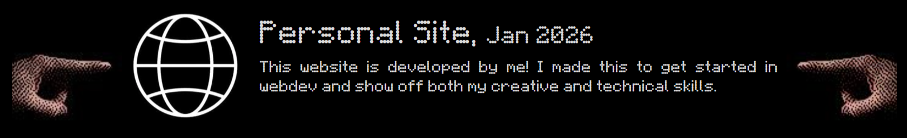
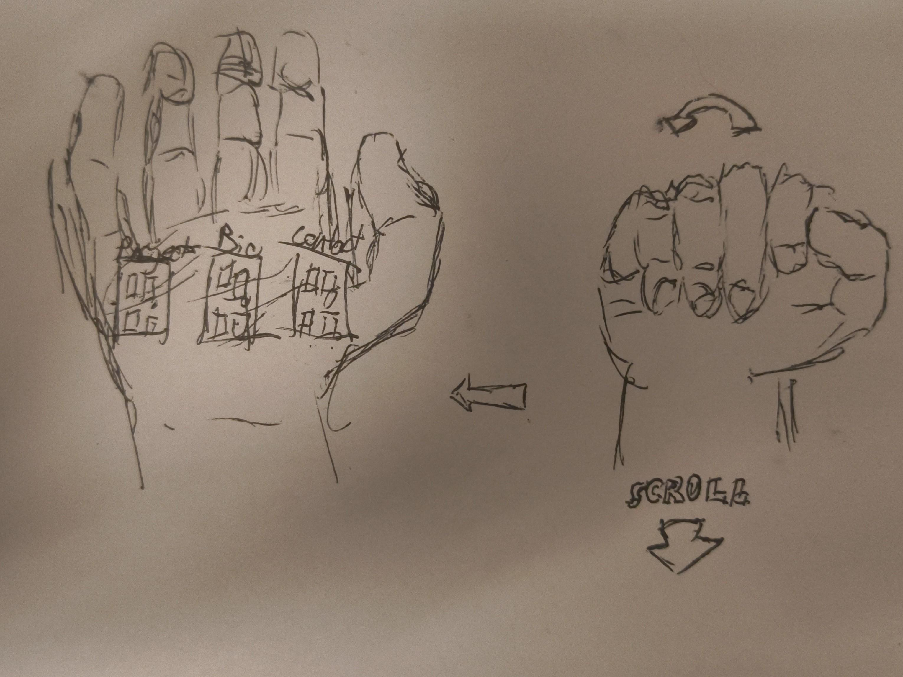

# Background

I started work on this website to host my work both for myself and interested parties. This is my first web development project and first time using HTML, CSS, and JS so I have much to learn. I started this work during my winter break, with ample free time, scope creep was quick to bite me. When school started back up, development slowed and I had to learn to develop a minimum viable product that I could enhance over time. I intend for this site to be a record of my work and a representation of my growth.

# Project Features

## Fast Page Creation

I knew I wanted the process of adding new project and essay entries to be seamless to encourage myself to maintain this site consistently. To achieve this, I developed two major features:

- The project/essay list pages are created completely from a json file.
- Each project and essay page is parsed from a markdown file.

### Json list pages

To make the project/essay list pages as flexible as possible I created a script to parse a json file and translate it to my desired HTML.
I wanted each entry to appear as follows:

The only elements that can change from entry to entry are:

- The thumbnail image
- The project title
- The project date
- The description

They were defined in a json file as follows:

```json
{
    "projects":[
        {
            "Image_path":"../images/Project_Thumbnails/Web_Icon.jpg",
            "Title":"Personal Site",
            "Date":"Jan 2026",
            "Bio":"This website is developed by me! I made this to get 
            started in webdev and show off both my creative and technical skills."
        }
    ]
}
```

To then get this into my webpage, I created a script to iterate through the json list and inject HTML accordingly:

```js
// Store the list container element
const list_container = document.getElementById("project_list")
// Import the json file
fetch('../json/projects.json')
    // Check for fetch error
    .then(response => {
    if (!response.ok) {
        throw new Error('Network response was not ok ' + response.statusText);
    }
    return response.json();
    })
  .then(data => {
    // Create an empty string to append HTML of project list
    let inner = '';
    let i=0;
    // Iterate through the projects list from the json file
    while (data.projects[i]) {
        // Append an HTML block to our string with desired elements from json file
        inner += 
        `
            <a>
                HTML BLOCK WITH ELEMENTS HERE
            </a>
        `;
        i++;
    }
    // Inject our string of HTML elements into our page
    list_container.innerHTML = inner;

  })
  // Catch fetch errors
  .catch(error => {
    console.error('There has been a problem with your fetch operation:', error);
  });
```

Now to add a new entry to my project list page, I just have to update the json file. No copy and pasting html required!

### Markdown project and essay pages

To keep myself motivated to write about my work in these pages, I wanted the development experience to be as similar as possible to my everyday writing. I have begun to write my notes in [Obsidian](https://obsidian.md/) which has forced me to get quick with markdown. I sought out a tool to convert my markdown files into clean HTML that I can inject straight into my page. This way, my time is primarily spend writing, not fiddling with complex HTML/CSS styling.

I found a tool called [\<zero-md>](https://zerodevx.github.io/zero-md/). With Zero-md I can import a markdown file and convert it into HTML in a handful of lines. It even allows for dynamic styles with CSS stylesheets. This way my md formatted pages look like they belong in my site.

To implement this feature I wrote the following code, ensuring to import the corresponding markdown file.

```HTML
<div id="project_content" style="max-width: 50%; margin-left: auto; margin-right: auto;">            
    <zero-md src="../project_documents/Personal Site.md" style="background-color:black">
        <template data-append>
            <link rel="stylesheet" href="../../../styles/md_style.css">
        </template>
    </zero-md>
</div>
```

Now you know the dirty secret of this page, its really just a markdown file.

## Programmatic Video/Image Editing

The [homepage](../../../../index.html) of my site was where everything began. I was sketching when I thought up this idea for a site homepage:


I wanted:
- The hand to open as the user scrolled down the page
- The hand to be pixelated and stylized in some manner
- The animation to be choppy, almost as if it was stop motion

On the webpage side, I figured I could have a large image that changed according to the scroll location of the page. This meant I needed a set of images for each "frame" of the animation.

The first task I tackled was getting frames from a video of my hand opening, this way no actual animation would be required and I could change the video if needed. I wrote a Python script using [OpenCV](https://docs.opencv.org/4.x/d6/d00/tutorial_py_root.html).

```Python
# Read the specified video
cam = cv2.VideoCapture("HandOpen.mp4")

# Current frame of the video
currentframe = 0
# Number to be included in image filepath
fileNum = 0
while(True):
    # Read from frame
    ret,frame = cam.read()
    # If a frame is not returned, end
    if ret:
        # Only save every other frame of the video
        if currentframe % 2 == 0:
            # Filepath for output image
            name = '.src/images/Hand_Palm_Open/Frame' + str(fileNum) + '.jpg'

            # Write the extracted images
            cv2.imwrite(name, frame)

            fileNum += 1

        # Increase counter so that it will
        # show how many frames are created
        currentframe += 1
    else:
        break
```

Then, I found an Atkinson dithering function from [tgray](https://github.com/tgray/hyperdither). (Fun fact: my inspiration for using atkinson dithering was the game Hylics, the art is fantastic) I put compressed each frame and dithered it to create a bitmask. I also posterized a copy of each compressed frame. Then I masked the posterized versions with the dithered versions to get the frames seen on the homepage. My function for stylizing each frame is shown below:

```Python
def styalize(inFilepath, outFilepath):

    img = Image.open(inFilepath)
    img = img.resize((int(img.width/24), int(img.height/24)))   # Pixelize
    img = remove(img).convert('RGB')                            # Convert to RGB format

    posterized = ImageOps.posterize(img, bits=3)                # Posterize to 3 bit color channels

    img = img.convert('L')                                      # Now convert the pre-posterized image to greyscale

    m = np.array(img)[:,:]
    m2 = dither(m, thresh = 127)                                # Dither the greyscale image
    ditherMask = Image.fromarray(m2[::-1,:])
    ditherMask.convert('1')                                     # Convert the dithered image to bit mask

    out = Image.new('RGB', (img.width, img.height))             # Create our final image

    out.paste(im=posterized, box=None, mask=ditherMask)         # Paste the posterized image with the dithered bitmask
    out.save(outFilepath, dpi=(72,)*2)                          # Save to the specified filepath
```

With these two scripts, an MP4 video of my hand can be automatically converted to a set of image "frames" for use on the homepage!

# Lessons Learned

This project was my first step into web development. I have learned HTML, CSS, and Javascript through the process of developing this site. My original goals and concepts for this site felt lofty but by chipping away at new features one-by-one I have gotten further than I could have imagined at the start. While I know my code may not be the prettiest, continued work with these tools will help me develop an intuition for the "clean" way to do things just as I have with other languages. I am delighted to have a new tool in my belt for my development future and I can't wait to continue expanding this site.

# A Statement on the use of Generative AI

Artificial Intelligence is being shoehorned into nearly every corner of the tech world. While it undeniably has applications in our lives, it is not the miracle it is often advertised. Hallucinations, infrastructure requirements, and unethically trained models aside, artificial intelligence is often used as a shortcut for learning. In my experience, lessons learned "the hard way" with head scratching and frustration, are the lessons that are the most pivotal in my development. I am currently setting the foundation which I will build my life and I do not intend to take shortcuts. Artificial intelligence was not used in this project, down to removing AI features from my browser. This is a human-made project so it will have mistakes, but that how we learn.
