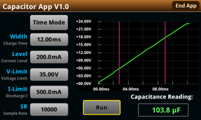
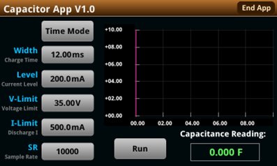
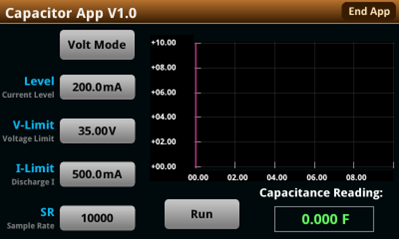
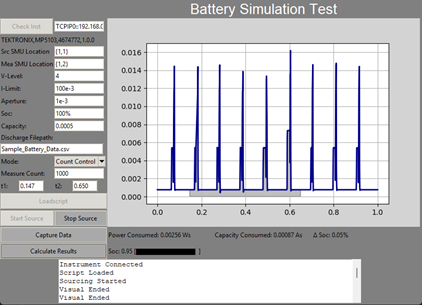
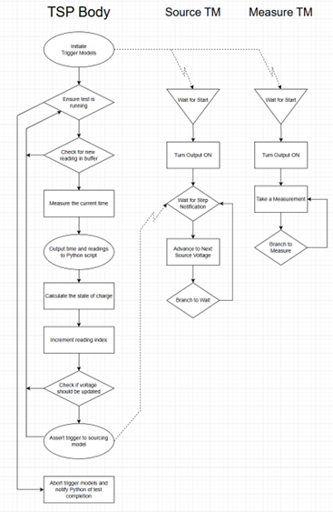

# Table of Contents

- [Background](#background)
- [Projecs](#projects)
    - [SMU 2461 Capacitance Measurement App](#smu-2461-capacitance-measurement-app)
    - [MP5000 Series Demo Library](#mp5000-series-demo-library)
    - [Applications University 2025 Lessons](#applications-university-2025-lessons)
    - [Battery Cycling Script](#battery-cycling-script)
    - [Battery Simulation Script](#battery-simulation-script)
        - [Interactive Test GUI](#interactive-test-gui)
        - [GUI Parallelization](#gui-parallelization)
        - [Trigger Model Parallelization](#trigger-model-parallelization)
        - [Custom Battery Data](#custom-battery-data)
- [Lessons Learned](#lessons-learned)
- [AI Use Statement](#a-statement-on-the-use-of-generative-ai)

# Background

I worked as an applications engineering co-op at Tektronix for six months. In my time there I was often given a dedicated project to make a sale or demonstrate different applications for our instruments. These projects gave me the perfect chance to fully understand what industry tasks may look like. I loved dedicating my time to learning new applications and how to achieve them.

# Projects

## SMU 2461 Capacitance Measurement App

Early in my time at Tektronix I was tasked with finishing an application for our SMU 2461. We had a customer that wanted to quickly characterize and bin capacitors. When I got the project the app would source a voltage pulse and graph the voltage response. However, the measurement would often return invalid capacitance measurements, it was slow for high sample sizes, and the methodology behind the test was fundamentally flawed. Also, the visualization did not show what data points were chosen for the capacitance measurement and would display useless data on either side of the graph.

First, I addressed the issue with the pulse testing method. According to the equation for current through a capacitor:
$$I_C = C \frac{dV_c}{dt}$$
Pulsing current then dividing the sourced current by the derivative of measured voltage with respect with time will give us capacitance.
$$\frac{I_C}{\frac{dV_c}{dt}} = C$$
By pulsing voltage the script is simpler but the calculations provide more room for error as it involves integration. I created two trigger models, one to pulse current while measuring voltage, and another to source 0V to discharge the capacitor safely. My making the trigger model more efficient, the graph also had far less unimportant data. These trigger models can be seen below:

```Lua
--############################################### Trigger Model ###############################################--
--################################################# Discharge #################################################--

    -- Reset trigger model to empty
    trigger.model.load("Empty")
    -- Recall discharge settings
    trigger.model.setblock(1, trigger.BLOCK_CONFIG_RECALL, "Measure_settings", 1, "Source_settings", 1)
    -- Set source voltage to 0V and wait until 0V is actually measured
    trigger.model.setblock(2, trigger.BLOCK_SOURCE_OUTPUT, smu.ON)
    trigger.model.setblock(3, trigger.BLOCK_DELAY_CONSTANT, 1e-5)
    trigger.model.setblock(4, trigger.BLOCK_MEASURE_DIGITIZE, defbuffer2, 1)
    trigger.model.setblock(5, trigger.BLOCK_BRANCH_LIMIT_CONSTANT, trigger.LIMIT_ABOVE, 0, 50e-3, 3, 4)
    trigger.model.setblock(6, trigger.BLOCK_SOURCE_OUTPUT, smu.OFF)
    -- After the second discharge, end trigger model
    trigger.model.setblock(7, trigger.BLOCK_BRANCH_ONCE_EXCLUDED, 0)

--################################################## Charge ###################################################--

    -- Recall charge settings
    trigger.model.setblock(8, trigger.BLOCK_CONFIG_RECALL, "Measure_settings", 2, "Source_settings", 2)
    -- Begin measurement
    trigger.model.setblock(9, trigger.BLOCK_SOURCE_OUTPUT, smu.ON)
    trigger.model.setblock(10, trigger.BLOCK_MEASURE_DIGITIZE, defbuffer1, trigger.COUNT_INFINITE)
    trigger.model.setblock(11, trigger.BLOCK_SOURCE_PULSE_OUTPUT, smu.ON)
    if currentMode == "Time Control" then
        -- Pulse current for time defined by user
        trigger.model.setblock(12, trigger.BLOCK_DELAY_CONSTANT, display.getvalue(timeWidth_id) - 85e-6)
    else
        -- Wait for voltage limit to be hit
        trigger.model.setblock(12, trigger.BLOCK_WAIT, trigger.EVENT_SOURCE_LIMIT)
    end
    trigger.model.setblock(13, trigger.BLOCK_SOURCE_PULSE_OUTPUT, smu.OFF)
    trigger.model.setblock(14, trigger.BLOCK_MEASURE_DIGITIZE, defbuffer1, trigger.COUNT_STOP)
    -- Once test is finished, turn off source and continue
    trigger.model.setblock(15, trigger.BLOCK_SOURCE_OUTPUT, smu.OFF)

    -- Loop back to discharge capacitor
    trigger.model.setblock(16, trigger.BLOCK_BRANCH_ALWAYS, 1)

--#############################################################################################################--
```

Next, I worked on solving the invalid measurements. Turns out, if poor test parameters were chosen and a reading overflow occurred, the point selection to estimate the derivative of voltage was completely broken. The derivative is calculated by finding a two points, one at 25% of the max and the other at 75%. With an overflow, the max was set to `+1e37`. Fixing this was a simple case of ignoring all overflow readings.

The measurement speed was an issue with the search method for finding these two points. The original app used a naive iterative search. I implemented a simple binary search as the voltage should be exclusively increasing for all data before the max value occurs. (Sometimes a capacitor will slightly discharge at the end of the current pulse, these values should and are ignored) This greatly reduced the measurement lag with working with high sample counts.

The end user wanted to see the datapoints being used for the calculation and, if needed, change said points. I used the build in GUI system to plot two horizontal cursors when the calculation is made. Then, if the user drags the cursors the capacitance measurement will update. Making this change was relatively simple but it went a long way in making the application user-friendly.



The original request for the app specifically included being able to adjust the time that the current is sourced. However, for other users, the simpler the better. So I configured the charging portion of the trigger model to either stop at a given delay or when a target voltage is reached based on what mode the user is in. This way you can choose simplicity or control. The GUI for both modes can be seen below:





## MP5000 Series Demo Library

When I began at Tektronix the MP5000 Series launch was right around the corner. This was a major step for the company as the modular test system opened a world of new applications. The applications team had developed some a handful of scripts to show off various features of the devices. However they had not been formally organized with instruction guides. This would be a running project for my six months with Tektronix.

Overall, I wrote 26 demonstration for both the PSU and SMU modules of the MP5000 series. Some of these had an existing script that I then translated to Python and write instructions for. The others were specific requests from field engineers and my supervisor. While the programs in these is not particularly complex (by design) the communication aspect of this library was vital.

This demo library would be seen by both Tektronix field engineers and customers who want to get to know their new devices. While I my code and instructions I kept in mind these two groups. I worked hard to make both easily understandable to people who were used to older instruments and even people new to test and measurement. The large number of demonstrations gave me plenty of practice for my technical communication abilities. When I met with field engineers I was repeatedly told that the demonstration library was far better than they were used to with prior instrument releases. 

## Applications University 2025 Lessons

Every year applications engineers gather at the Keithley office to learn about new products, new applications, and the future of Tektronix. With the release of the MP5000 soon ahead it was a popular topic for learning. I was tasked with creating six hands-on demonstrations and labs for field engineers to complete. Luckily I had plenty of demonstration writing experience from the MP5000 Series demo library.

The real challenge came when it was time to teach these labs live. Not only were multiple new software bugs found and later diagnosed, I had to juggle working with multiple engineers above me. Often I would attempt to explain a concept only to realine they were coming from a completely different context than I had. These engineers had been working with our instrumentation for many years whereas my first instruments were the MP5000 Series. I learned to put myself in their shoes and contextualize new concepts into their relation to older instruments that the engineers would be more familiar with.

## Battery Cycling Script

One proposed application of the MP5000 series was battery testing and characterization. After researching how battery cycling tests are performed I created a script to reliably and safely cycle a battery and record all the necessary data. This script achieved:

1) Consistent remote communication with a SMU and DMM
2) Current sourcing/sinking and voltage measuring
3) Temperature sensing and safety cutoff
4) Clean output to `.csv` format for easy analysis

This script also served as a long-term communication test for the MP5000 system. I was able to characterize communication breakdown by recording timestamps and specific error codes.

I used a new to me technique to achieve truly parallel measurement and file i/o. By creating an array of TSP commands as strings, I could write and start a script for the instrument completely remotely. Then the PC running the program could fetch data from the instrument and write it to the output file. 

```Python
def load_cycle_script():
    # Script header
    sense = f""
    if remote_sense:
        sense = f"{smu}.SENSE_4WIRE"
    else:
        sense = f"{smu}.SENSE_2WIRE"
    smu_inst.write("loadscript batteryCycle")
    script_cmd = [
        # Discharge settings
        f"{smu}.configlist.create(\"discharge_config\")",
        f"{smu}.source.output = 0",
        f"{smu}.source.offmode = {smu}.OFFMODE_HIGH_Z",
        f"{smu}.source.func = {smu}.FUNC_DC_CURRENT",
        f"{smu}.source.leveli = {dischargeI} * -1",
        f"{smu}.source.rangei = {dischargeI}",
        f"{smu}.source.limitv = {highVlim}",
        f"{smu}.measure.rangev = {highVlim}",
        f"{smu}.measure.rangei = {dischargeI}",
        f"{smu}.sense = {sense}",
        f"{smu}.configlist.store(\"discharge_config\")",

        # Rest of script following here
    ]
    # Write and execute tsp script
    for cmd in script_cmd:
        smu_inst.write(cmd)
    smu_inst.write("endscript")
    smu_inst.write("batteryCycle()")
```

Running the script that actually performs the battery cycling fully on the instrument added another level of redundancy to the system. If the PC to instrument communication failed, the instrument would continue to cycle the battery safely. Only a loss of data would occur. I implemented this feature after a failed USB communication left my instrument draining the battery. With no communication from the PC it was never told to stop sinking current, therefore draining the battery far beyond it's ideal operating point. This rendered the test battery destroyed.

I also had to ensure a message was ready in the output queue before requesting one from the PC. Otherwise I would run the risk of hitting a timeout error and halting the test. To do this I used the status model of the instrument, checking if the "Message Available" bit was flipped.

```Python
meas_ready = smu_inst.read_stb()    # Check status byte
if meas_ready & 0b10000 == 16:      # If a message is ready in terminal then read it
    raw_data = smu_inst.read()
```

While this project was conceptually simple, there were multiple small details that were vital in ensuring a safe and reliable test. This project got me thinking much more about the "worst case" problem.

## Battery Simulation Script

Similar to the battery cycling script, this project displayed yet another application of the MP5000 Series. This battery simulation app would replace a previous project that required a specialized power supply and an SMU that could simulate a battery and capture current usage data. This kind of system is especially for low power applications like IoT devices where battery life is vital. This project was the most complex system I created while at Tektronix.

### Features

#### Interactive Test GUI

Most of my projects haven't needed a GUI as the configuration was relatively simple and any graphical output could be achieved with a simple plot. This project would need around 13 user parameters, a complex graph, and a terminal-like output. Chose to use Tkinter for it's simplicity and vast feature set. Most important of these being plot integration with matplotlib. The GUI ended up looking as shown below.



One of my favorite features of the GUI is the integration shading. This feature clearly communicates what region is integrated over to calculate the power consumed, capacity consumed, and change in state of charge of the simulated battery. Another, debatably useful, feature is the state of charge bar. As the simulated battery sources power to a circuit, the progress bar will update to reflect the charge of the battery. I found a clean way to translate a proportion to an arbitrarily sized loading bar with partial unicode blocks.

All of the test control buttons were dynamically enabled and disabled to dummy proof the test, never allowing an unexpected program state to occur. The console output let me directly communicate to the user as the test advanced. If any errors occurred they could be printed to this console.

#### GUI Parallelization

Battery simulation tests can often run for long periods of time. While power is sourced by the simulated battery the Python script must read the output data and organize it accordingly. This has the distinct side effect of "freezing" the GUI, leading to an unresponsive app that would load until the capture is completed. To solve this I used parallelization with the Python `threading` library. By opening a separate thread to run the test, the GUI would be left uninterrupted in the main thread.

When the "Start Sourcing" button is selected in the GUI, the following function is called to open a new thread to run the sourcing functions.

```Python
def thread_run(self):
    try:
        # If a thread is open, join it back to main
        if self.test_thread != "":
            self.test_thread.join()
        # Begin a new thread to keep GUI responsive
        self.test_thread = threading.Thread(target=self.start_sourcing)
        self.test_thread.start()
    except Exception as e:
        # Display error to user
        self.throw_error(f"Error: {e}")
```

#### Trigger Model Parallelization

Trigger models lie at the heart of this app. By combining two source-measure units (one for sourcing and one for measuring) the app can continuously calculate the state of charge of the simulated battery and change its sourced voltage to mimic the discharge of a real battery. This requires a delicate balance of two trigger models, a TSP main script written to the instrument by the Python script, and a monitoring loop in the Python script to capture measured data.

A flowchart of the two trigger models and TSP script is shown below:



The measuring trigger model simply waits for a trigger from the TSP script, then continuously measures. The sourcing SMU waits for the same starting trigger to start sourcing voltage. When a second kind of trigger is received, it will advance to the next voltage in the source voltage list from the user input `.csv` file (see more below).

The main TSP loop is much more complicated. It must check the test should continue, output data to the Python script, calculate the state of charge of the simulated battery and notify the sourcing trigger model if the voltage should be advanced. While these steps are individually simple, I had to take special care to optimize every iteration as a slow program would lead to inaccuracies in the simulated battery.

To test that this part of the program worked fast enough, I would simulate an extremely small battery to a resistive load while externally monitoring the current with an oscilloscope. Using scope math functions I displayed the total capacity used over the discharge, if this result deviated from the set capacity of the simulation I knew my test was inaccurate.

The main loop of the TSP script looks as follows:

```Lua
-- Check that battery is not empty and there is no command in the command queue
while asserts < math.floor(initial_soc*srcListSize+0.5) and bit.bitand(status.operation.remote.condition, status.operation.remote.CAV) == 0 do
    -- Check that index is in bounds, if not wait until it is
    if  index1 <= readingBufferi.n then
        -- Update current time
        t2, t2_frac = os.time()
        -- Output data to Python file
        print((t2+t2_frac)-(t1+t1_frac), readingBufferi[index1], sourceList[asserts], soc)
            
        -- Calculate SOC with current integral, riemann sum
        soc = soc - (readingBufferi[index1]*aperture)/capacity
        -- Iterate index
        index1 = math.mod(index1,bufferSize) + 1

        -- Check if soc has crossed to new bin and voltage needs to be updated
        if (math.floor(prev_soc*srcListSize) - math.floor(soc*srcListSize)) >= 1 then
            trigger.generator[2].assert()
            asserts = asserts + 1
        end
        prev_soc = soc
        -- If the end of the buffer has been reached, clear the buffer
        if index1 == 1 then
            readingBufferi.clear()
        end
    end
end
-- End both trigger models and turn ouputs off
slot[src_slot_no].trigger.model.abort(src_tm_name)
slot[mea_slot_no].trigger.model.abort(mea_tm_name)
slot[src_slot_no].smu[src_chan_no].source.output = 0
slot[mea_slot_no].smu[mea_chan_no].source.output = 0
```

My favorite underrated feature in the TSP script is the CAV check every iteration. This checks if there is a command available from the Python script, allowing it to interrupt the main loop.

I tried multiple methods of integration for the state of charge calculation, however, a simple riemann sum was the fastest and was still extremely accurate. Other methods like a trapezoidal sum were too slow.

Since the main TSP loop is not necessarily in sync with the readings coming in from the measuring trigger model, I had to take special care to avoid accessing invalid data. I also had to ensure buffer filling was handled correctly. The best way to do this while keeping the script fast was always checking the index being read was less than the total number of readings available, then when the end of the buffer was reached, clear it. This completely overrides the circular nature of the buffer being used. This does have the chance of clearing some new readings that circled to the front of the buffer but keeping the loop fast reduces the effect of this.

Ultimately this section of the program took the most iteration. Finding the balance between speed and accuracy was key. I loved working through the nitty gritty details of each command call to ensure the top efficiency. I fully believe the resulting program found the perfect sweet spot.

#### Custom Battery Data

Every battery has a unique discharge curve that related the state of charge with battery voltage. To allow for maximum flexibility, I decided to use a `.csv` file input with columns for each of these variables. This data is loaded onto the instrument. As more power is used by the load circuit, the simulated battery will change it's voltage according to the data.

In the `load_script` function, the following snippet appears to write the data to the instrument. This must be done one line at a time to avoid an input buffer overrun

```Python
# Iterate through the voltages in the .csv file
for i in range(len(srcList)-1):
    # Append the voltage point to the script that will be sent to the instrument
    cmd_buffer.append(str(srcList[i])+",")
cmd_buffer.append(str(srcList[len(srcList)-1]))
```

The source list for the sourcing SMU is then set to be this voltage list:

```Lua
src_smu.trigger.source.listv(sourceList)
```

The major downside of this system is the script assumes the data points have a linearly interpolated state of charge from 1.0 to 0.0. A future improvement to the script should take measures to remove this assumption.

# Lessons Learned

I learned countless lessons in my time at Tektronix, I worked with a quality team who always made time to answer my questions and talk me through technical processes. It was a true joy to complete these projects for the team. I learned to work in the industry environment, ask questions even when it may be embarrassing, and quickly pick up new knowledge. Often when I began a project I was using a product or features for the first time. The constant novelty kept me on my toes and learning new skills.

Many of my projects prior to this had been personal with no deadlines in sight. In school, I have usually been given an exact timeline for completion. This position was a deadly middle ground, timeline expectations were given but not necessarily monitored. I was fully responsible for managing all my projects, customer tasks, and other work to meet all expectations. When something ran behind I had to communicate that to all relevant parties. My desk was always covered in prioritized todo lists which became my best tool. I believe this is one of the best skills I developed that I could not have found elsewhere.

I developed multiple technical skills that will continue to serve me through my career. Tektronix being a test and measurement company, I got very familiar with a wide range of tools. This includes digital multimeters, power supplies, source measure units, data acquisition systems, oscilloscopes and more. I operated these both as a customer would and working behind the scenes to diagnose bugs, giving me a well-rounded understanding of their operation. Now I feel much more equipped to work in a lab environment and I feel confident I could learn to use and program any new instrument.

# A Statement on the use of Generative AI

Artificial Intelligence is being shoehorned into nearly every corner of the tech world. While it undeniably has applications in our lives, it is not the miracle it is often advertised. Hallucinations, infrastructure requirements, and unethically trained models aside, artificial intelligence is often used as a shortcut for learning. In my experience, lessons learned "the hard way" with head scratching and frustration, are the lessons that are the most pivotal in my development. I am currently setting the foundation which I will build my life and I do not intend to take shortcuts. Artificial intelligence was not used in this project. This is a human-made project so it will have mistakes, but that how we learn.
